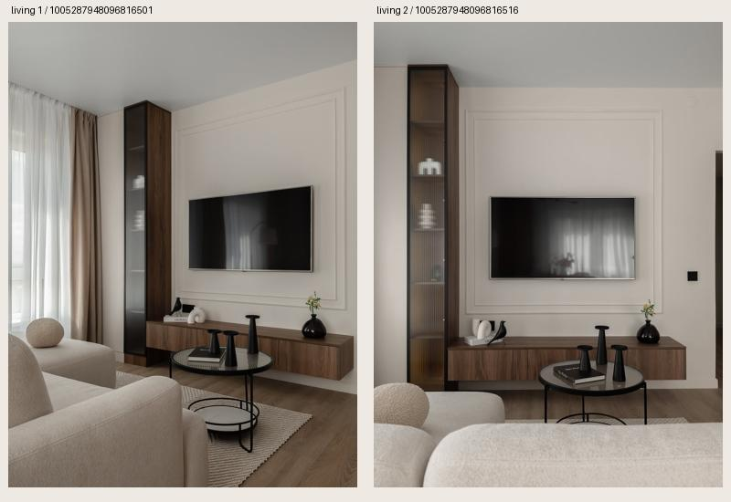
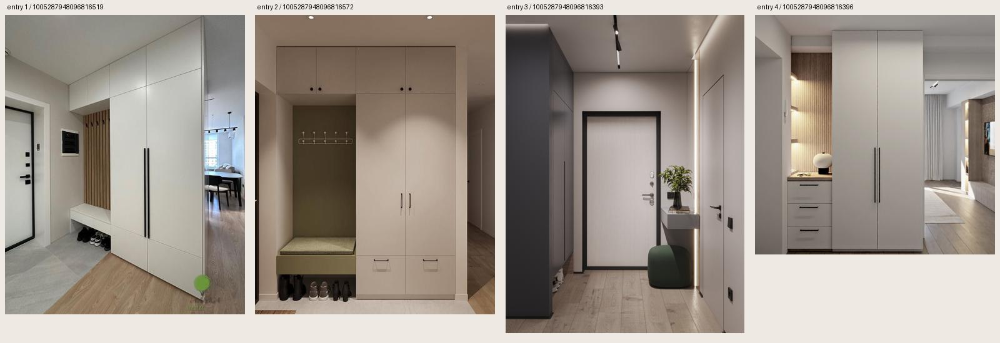
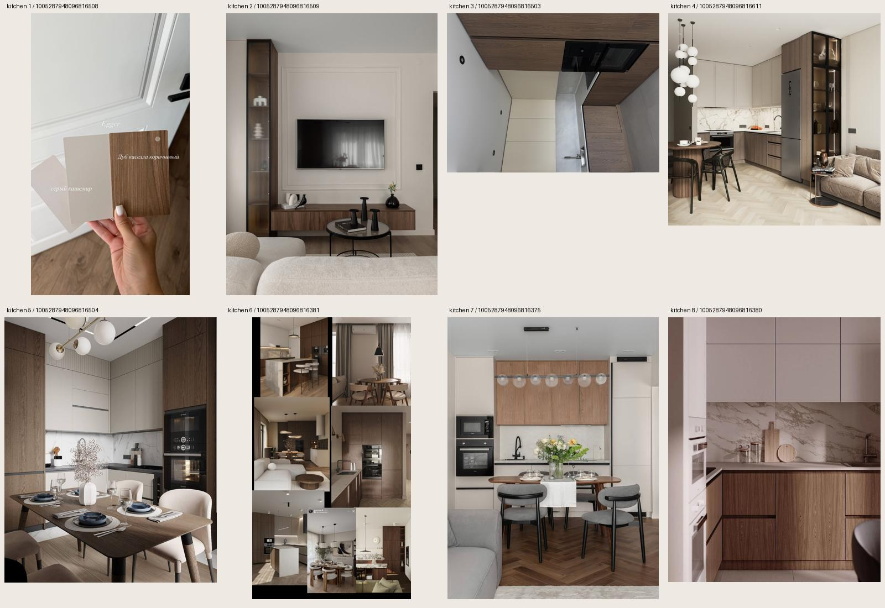

# Референсы интерьера: зал, прихожая и кухня

Снимок досок Pinterest сохранён 29 сентября 2026 года.
Сохранены все 14 пинов: 2 для зала, 4 для прихожей и 8 для кухни.
Один и тот же вид ТВ-зоны встречается в двух досках, поэтому уникальных изображений 13.
Рекомендации Pinterest из раздела More like this в подборку не включены.
Изображения используются как локальные референсы проекта; лицензия на свободное использование фотографий не установлена.

## Что переносим в интерьер

| Зона | Наблюдаемое в референсах | Решение в модели |
| --- | --- | --- |
| Зал | Светлая мягкая мебель, тёплые стены с молдингами, подвесная деревянная ТВ-тумба, высокая витрина, чёрный круглый столик | Кремовый диван вдоль левой стены, ТВ и подвесная тумба напротив, витрина у окна, небольшой круглый столик |
| Прихожая | Шкаф до потолка, открытая ниша с сиденьем, вертикальные рейки, длинные чёрные ручки | Шкаф с лавкой и реечной нишей у стены санузла; зеркало на свободном участке у входа |
| Кухня | Коричневое дерево, матовые фасады серо-бежевого цвета, светлая столешница и фартук, чёрная техника, мягкие стулья | Г-образный гарнитур в существующей кухонной зоне; деревянный низ, светлый верх, обеденный стол и 4 стула |

На образце в кухонном пине читаются названия «Серый кашемир» и «Дуб каселла коричневый».
Цвета Blender подобраны визуально по изображениям; это не точная цветопередача или подтверждённые артикулы материалов.

## Источники и локальные копии

### Зал референсы

[Открыть доску](https://www.pinterest.com/lianapepanyann/%D0%B7%D0%B0%D0%BB-%D1%80%D0%B5%D1%84%D0%B5%D1%80%D0%B5%D0%BD%D1%81%D1%8B/)

| Пин | Локальное изображение |
| --- | --- |
| [1. 1005287948096816501](https://www.pinterest.com/pin/1005287948096816501/) | [Оригинал](images/living-1005287948096816501.jpg) |
| [2. 1005287948096816516](https://www.pinterest.com/pin/1005287948096816516/) | [Оригинал](images/living-1005287948096816516.jpg) |

### Прихожая референсы

[Открыть доску](https://www.pinterest.com/lianapepanyann/%D0%BF%D1%80%D0%B8%D1%85%D0%BE%D0%B6%D0%B0%D1%8F-%D1%80%D0%B5%D1%84%D0%B5%D1%80%D0%B5%D0%BD%D1%81%D1%8B/)

| Пин | Локальное изображение |
| --- | --- |
| [1. 1005287948096816519](https://www.pinterest.com/pin/1005287948096816519/) | [Оригинал](images/entry-1005287948096816519.jpg) |
| [2. 1005287948096816572](https://www.pinterest.com/pin/1005287948096816572/) | [Оригинал](images/entry-1005287948096816572.jpg) |
| [3. 1005287948096816393](https://www.pinterest.com/pin/1005287948096816393/) | [Оригинал](images/entry-1005287948096816393.png) |
| [4. 1005287948096816396](https://www.pinterest.com/pin/1005287948096816396/) | [Оригинал](images/entry-1005287948096816396.png) |

### Кухня референсы

[Открыть доску](https://www.pinterest.com/lianapepanyann/%D0%BA%D1%83%D1%85%D0%BD%D1%8F-%D1%80%D0%B5%D1%84%D0%B5%D1%80%D0%B5%D0%BD%D1%81%D1%8B/)

| Пин | Локальное изображение |
| --- | --- |
| [1. 1005287948096816508](https://www.pinterest.com/pin/1005287948096816508/) | [Оригинал](images/kitchen-1005287948096816508.jpg) |
| [2. 1005287948096816509](https://www.pinterest.com/pin/1005287948096816509/) | [Оригинал](images/kitchen-1005287948096816509.jpg) |
| [3. 1005287948096816503](https://www.pinterest.com/pin/1005287948096816503/) | [Оригинал](images/kitchen-1005287948096816503.heic); [JPEG для просмотра](images/kitchen-1005287948096816503.preview.jpg) |
| [4. 1005287948096816611](https://www.pinterest.com/pin/1005287948096816611/) | [Оригинал](images/kitchen-1005287948096816611.jpg) |
| [5. 1005287948096816504](https://www.pinterest.com/pin/1005287948096816504/) | [Оригинал](images/kitchen-1005287948096816504.jpg) |
| [6. 1005287948096816381](https://www.pinterest.com/pin/1005287948096816381/) | [Оригинал](images/kitchen-1005287948096816381.png) |
| [7. 1005287948096816375](https://www.pinterest.com/pin/1005287948096816375/) | [Оригинал](images/kitchen-1005287948096816375.jpg) |
| [8. 1005287948096816380](https://www.pinterest.com/pin/1005287948096816380/) | [Оригинал](images/kitchen-1005287948096816380.jpg) |

Полные URL изображений, размеры и SHA-256 сохранены в [sources.json](sources.json).

## Модели и результат

- [Выбор моделей, лицензии и изменения](models.md).
- [Расстановка, ограничения и управление видимостью](../../blender_project/INTERIOR.md).
- [Файл Blender](../../blender_project/apartment_interior.blend).
- [Общий вид](../../blender_project/interior-previews/overview.png).
